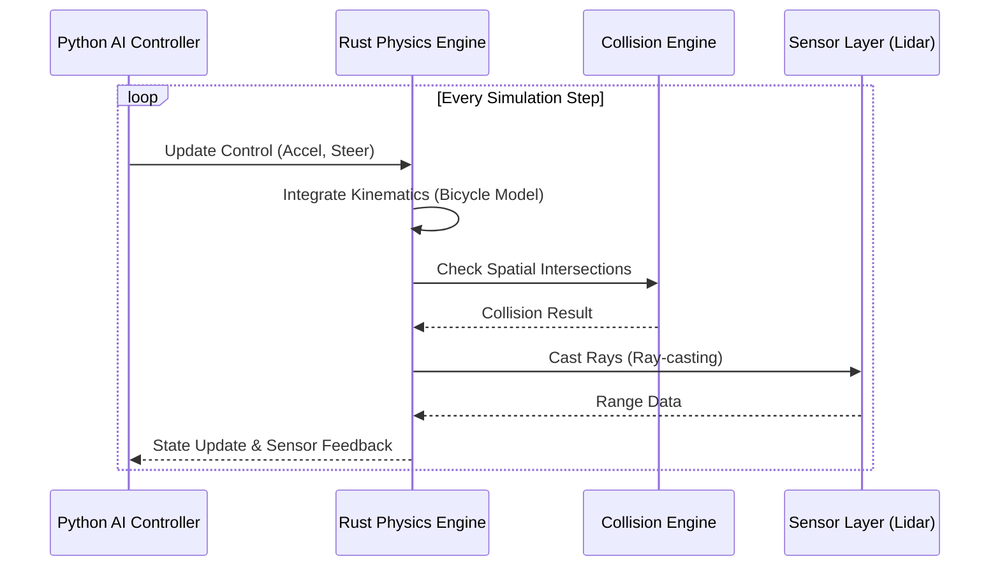

# Autonomous Vehicle Simulation Framework

[](https://opensource.org/licenses/MIT)
[](https://www.rust-lang.org/)
[](https://www.docker.com/)

A production-grade, high-performance simulation engine for robotics and autonomous driving. This framework leverages a **Rust-powered physics engine** exposed via **PyO3** for maximum performance and portability.

## The Mission
Transition from a Python-heavy prototype to a professional robotics platform prioritized for **Speed**, **Portability**, and **Scientific Clarity**.

---

## Architecture

The lifecycle of a single simulation frame is optimized by offloading heavy spatial calculations to Rust.



---

## Technical Specification: Vehicle Dynamics

### Kinematic Bicycle Model
The vehicle dynamics are modeled using a non-linear kinematic bicycle model, which provides a high fidelity representation of steering constraints while remaining computationally efficient.

The state vector is defined as $s = [x, y, \psi, v]$, where:
- $(x, y)$: Rear-axle position
- $\psi$: Heading angle (yaw)
- $v$: Longitudinal velocity

The state transition equations implemented in Rust:
- $\dot{x} = v \cos(\psi)$
- $\dot{y} = v \sin(\psi)$
- $\dot{\psi} = \frac{v}{L} \tan(\delta)$
- $\dot{v} = a$

Where:
- $L$: Wheelbase length (configurable in `settings.yaml`)
- $\delta$: Steering angle
- $a$: Acceleration

---

## Performance Features
- **Zero-Cost Abstractions**: Physics logic (ray-casting, collisions) implemented in Rust for $O(1)$ loop overhead.
- **Portability**: Full Docker support with NVIDIA/CUDA GPU acceleration for perception layers.
- **Configuration**: Decoupled parameters via `config/settings.yaml`.

---

## Installation & Usage

### Local Development
Requires Rust Toolchain and Python 3.10+.

```bash
# Build the Rust engine
make build

# Run the simulation
make run
```

### Docker (Recommended)
Build and run the entire stack with GUI support:

```bash
# Build container
make docker-build

# Run container (supports X11 forwarding)
make docker-run
```

---

## Project Structure

```text
/
├── rust_engine/         # High-performance Rust core
│   ├── src/
│   │   ├── kinematics.rs # Bicycle model implementation
│   │   ├── collision.rs  # AABB/OBB detection
│   │   └── raycast.rs    # Efficient ray-casting for Lidar
│   └── Cargo.toml
├── src/                 # Python logic (Perception/Planning)
├── config/              # YAML simulation parameters
├── Dockerfile           # Multi-stage production build
├── docker-compose.yml   # GUI & GPU orchestration
└── Makefile             # Developer shortcuts
```
